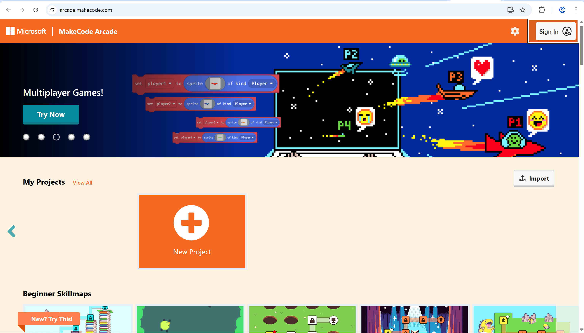
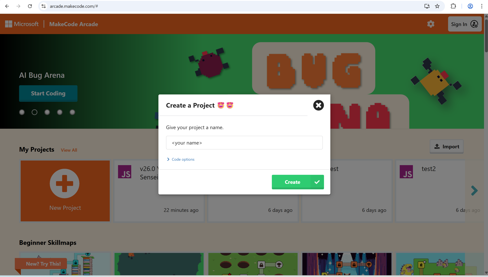
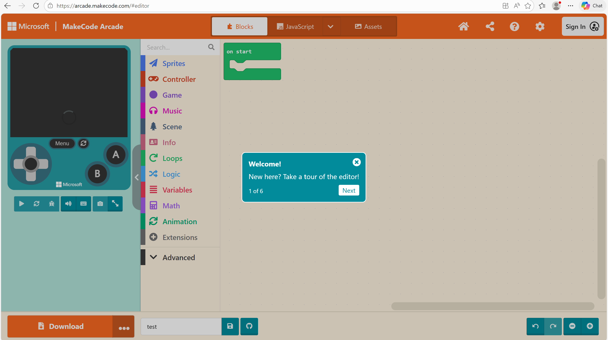
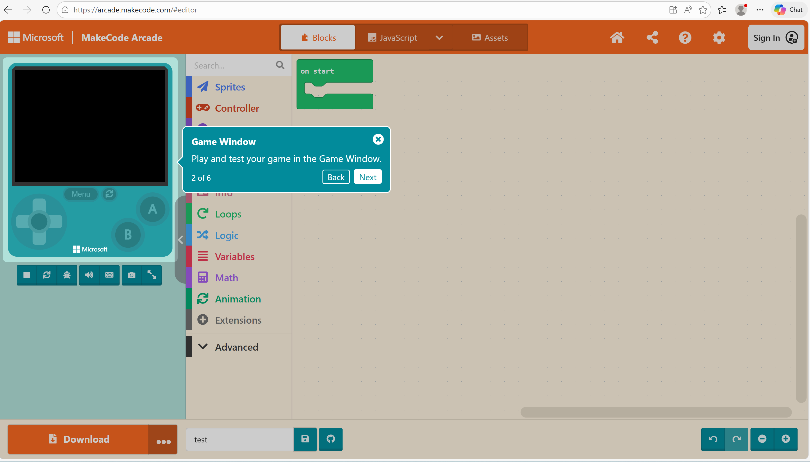
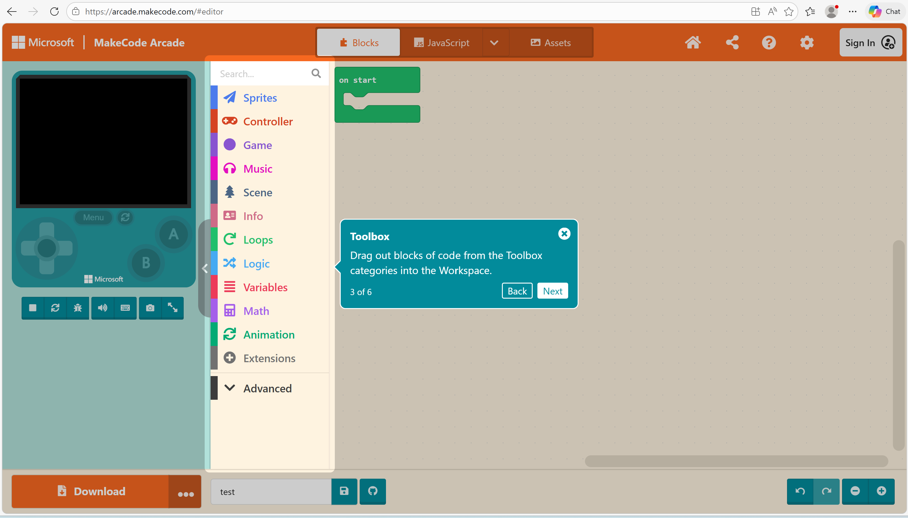
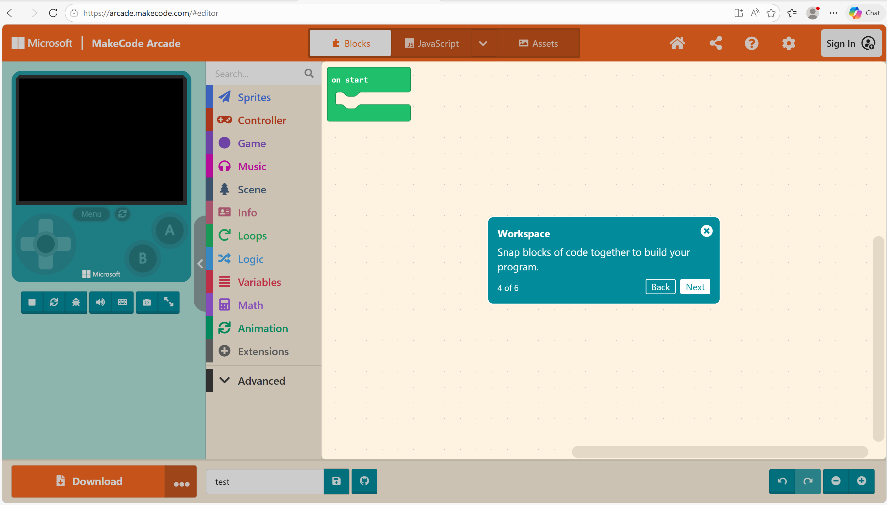
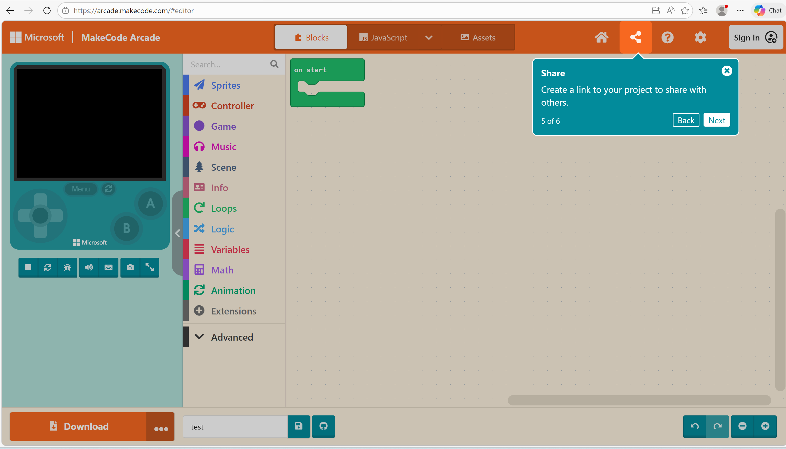
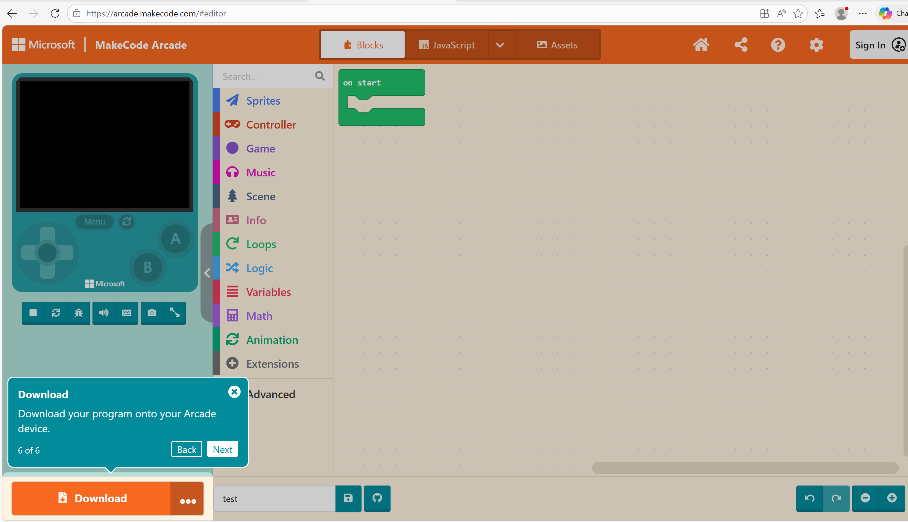
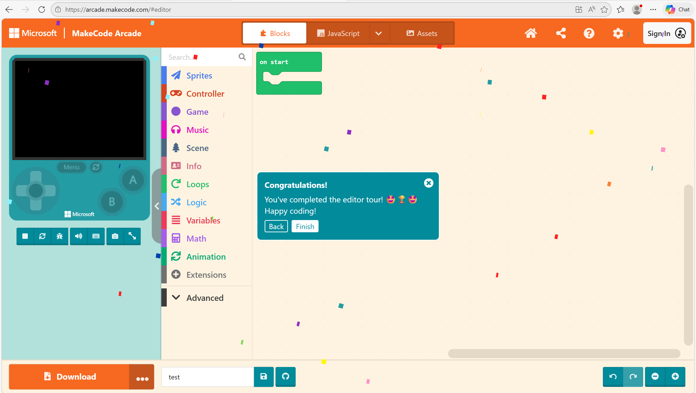

# Project Structure

## Using MakeCode Arcade 

In order to user to create 2D or 3D games in MakeCode Arcade, you will first have to go install or use the browser version of Makecode Arcade by going to the Website: https://arcade.makecode.com/#

The screenshot in this document will show the installers for Windows. The UI will be slightly different on other operating systems, but the overall process will be the same.

Installing or Using MakeCode Arcade in Windows:

Most Linux distributions should already come with an up to date Python interpreter, but Windows doesn't have one by default and Mac come packaged an outdated version.

1. Go to the official MakeCode Arcade [Link Text](https://arcade.makecode.com/#) on the computer you want to install MakeCode Arcade to.
2. The website should automatically detect your operating system and change the main download button to the correct version of the installer. If the auto detection is not correct, click on of the options below to manually select the version.

3. Click to create a new MakeCode Arcade Game.

4. When you typed your name of Workspace game. Click "Create" Green Button.

5. You will get a prompt of tutorial instructions which can be useful if you are new here. Or you can skip the tutorial instructions.

Welcome page of the MakeCode Arcade Game:

The Game Window of the MakeCode Arcade Game:

The Toolbox  structure workspace of the game:

This section is the workspace of the makecode arcade

In this image you can share to your self with link or to the others

In this image you can download the your project.

In the image you are done the workspace and you can start the game workspace.

