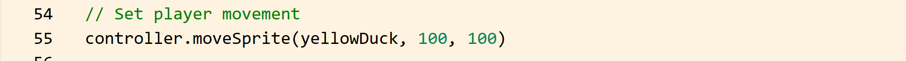
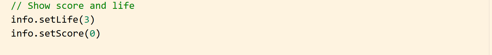
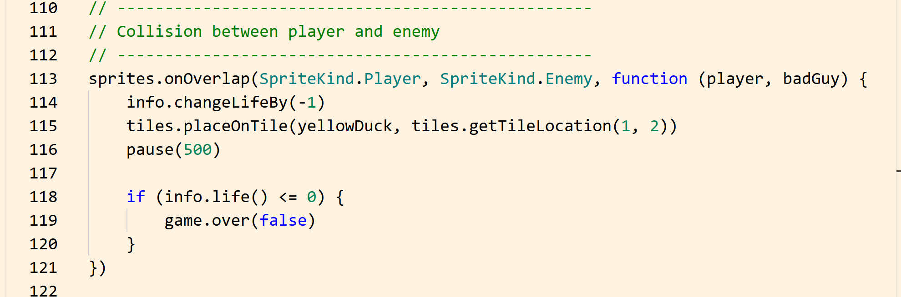
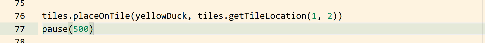
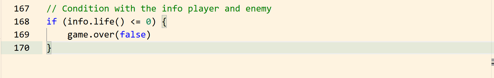
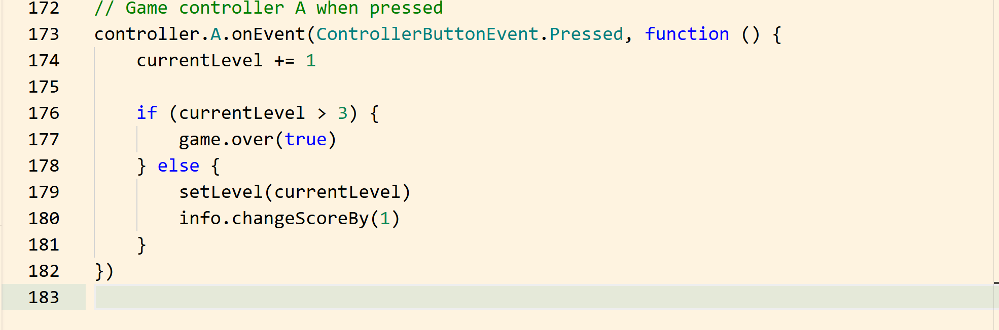
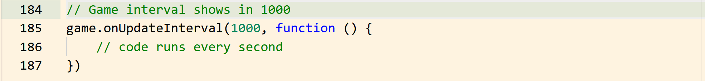

# Game Controls and Events in MakeCode Arcade

In this tutorial, you will learn how to control gameplay in MakeCode Arcade.  
This includes player movement, score tracking, life system, collision detection, and changing levels.

Game controls and events make your game interactive and responsive to player actions.

---

## Introduction to Game Controls

Game controls allow the player to interact with the game using the keyboard or controller.  
Events are used to trigger actions when something happens, such as pressing a button or colliding with an enemy.

In this section, you will:

- control the player movement  
- add score and life systems  
- detect collisions  
- create button events  
- manage game progression  

---

## Step 1: Enable Player Movement

To allow the player to move, use the `controller.moveSprite()` function.

```javascript
controller.moveSprite(yellowDuck, 100, 100)
```



- This allows movement in all directions using the arrow keys.

- 100 controls horizontal speed

- 100 controls vertical speed

## Step 2: Add Life System

- The life system tracks how many chances the player has before the game ends.
  
```javascript
info.setLife(3)
```

- This gives the player 3 lives at the start of the game.



## Step 3: Add Score System

- The score system tracks the player’s progress.
  
```javascript
info.setScore(0)
```

- You can increase the score when the player completes a level:
  
```javascript
info.changeScoreBy(1)
```

## Step 4: Detect Collision Between Player and Enemy

- Use an overlap event to detect when the player touches the enemy.

```javascript
sprites.onOverlap(SpriteKind.Player, SpriteKind.Enemy, function (player, badGuy) {
    info.changeLifeBy(-1)
})
```

When a collision happens:

- the player loses one life



## Step 5: Reset Player Position After Collision

- After a collision, it is helpful to reset the player’s position.

```javascript
tiles.placeOnTile(yellowDuck, tiles.getTileLocation(1, 2))
pause(500)
```

- This prevents immediate repeated collisions.



## Step 6: End Game When Life Reaches Zero

- Add a condition to end the game when the player has no lives left.

```javascript
if (info.life() <= 0) {
    game.over(false)
}
```

- False means the player loses

- True would mean the player wins



## Step 7: Create Button Event for Level Change

Use a button event to allow the player to move to the next level.

```javascript
controller.A.onEvent(ControllerButtonEvent.Pressed, function () {
    currentLevel += 1

    if (currentLevel > 3) {
        game.over(true)
    } else {
        setLevel(currentLevel)
        info.changeScoreBy(1)
    }
})
```



This:

- Increases the level

- Loads the next level

- Increases the score

- Ends the game if all levels are completed

## Step 8: Use Update Events (Optional)

You can use update events to run code repeatedly.

```javascript
game.onUpdateInterval(1000, function () {
    // code runs every second
})
```

This is useful for:

- Enemy movement

- Timers

- Repeated actions



## Summary

In this tutorial, you learned how to:

- Enable player movement

- Create a life system

- Create a score system

- Detect collisions

- Reset player position

- End the game

- Use button events

- Control game flow

Game controls and events are essential for making your game interactive and engaging.

## Tips

- Keep movement speed balanced

- Always test collisions carefully

- Reset player position after damage

- Use events to control gameplay flow

- Keep your code organized
