# Glossary

**MakeCode Arcade**  
A web-based platform by Microsoft used to create 2D games using blocks or JavaScript. It includes tools for sprites, tilemaps, and testing games.

**JavaScript**  
A programming language used to control game logic, movement, and interactions.  
Example:

```javascript
controller.moveSprite(player, 100, 100)
```

## Blocks

- A visual way of coding where you drag and connect blocks instead of typing code.
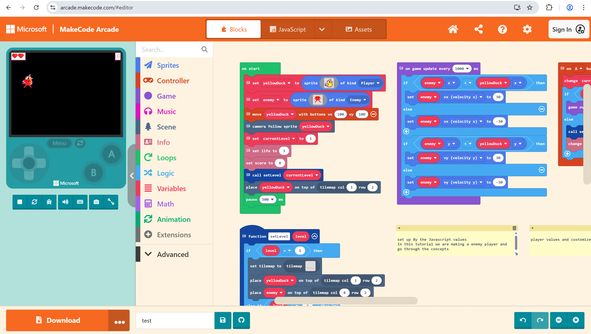

## Sprite

- A visual object in the game, such as a player, enemy, or item.

## Player Sprite

- The main character controlled by the user.
  
- Example:

```javascript
let player = sprites.create(img`...`, SpriteKind.Player)
```

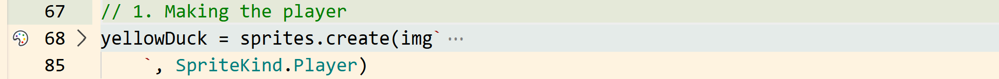

## Enemy Sprite

- A sprite that challenges the player by chasing or interacting with them.
  
Example:

```javascript
let enemy = sprites.create(img`...`, SpriteKind.Enemy)
```

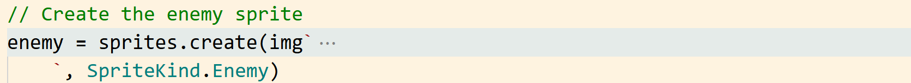

## SpriteKind

- A category used to define types of sprites (Player, Enemy, etc.).

Example:

```javascript
SpriteKind.Player
SpriteKind.Enemy
```

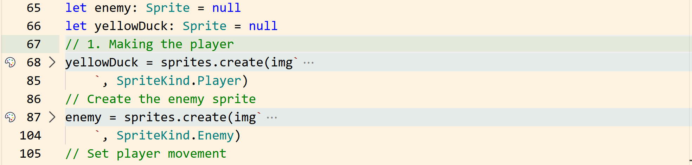

## Tilemap

- A grid-based layout that defines the game level.
  
Example:

```javascript
tiles.setCurrentTilemap(tilemap`level1`)
```

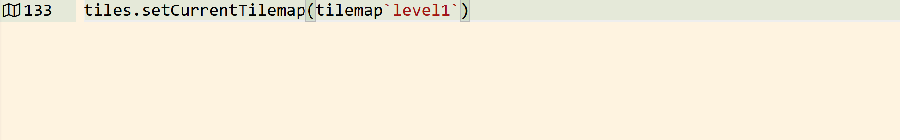

## Location

- A position on the tilemap grid where sprites are placed.
  
Example:

```javascript
tiles.placeOnTile(player, tiles.getTileLocation(1, 2))
```

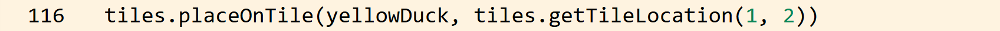

## Collision (Overlap)

- When two sprites touch each other and trigger an event.
  
Example:

```javascript
sprites.onOverlap(SpriteKind.Player, SpriteKind.Enemy, function () {
    info.changeLifeBy(-1)
})
```

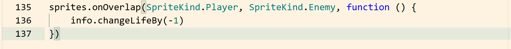

## Velocity

- The speed and direction of a sprite’s movement using vx and vy.
  
Example:

```javascript
enemy.vx = 30
enemy.vy = -30
```

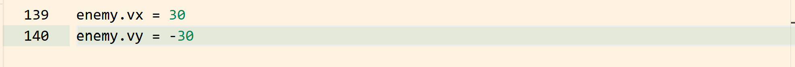

## Event

- A trigger that runs code when something happens (like a button press).
  
Example:

```javascript
controller.A.onEvent(ControllerButtonEvent.Pressed, function () {})
```

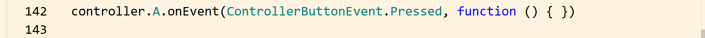

## Function

- A reusable block of code used to perform a task.
  
Example:

```javascript
function setLevel(level: number) {}
```

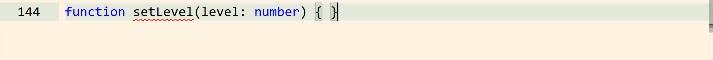

## Level

- A stage in the game with its own layout and difficulty.

## Camera

- Controls what part of the game is visible on screen.
  
Example:

```javascript
scene.cameraFollowSprite(player)

```

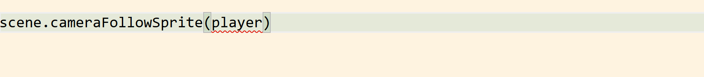

## Score

- Tracks the player’s progress or achievements.
  
Example:

```javascript
info.changeScoreBy(1)

```

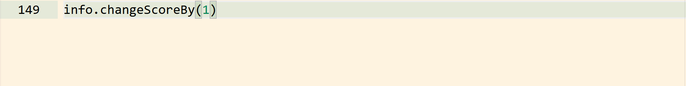

## Life

- Represents how many chances the player has before the game ends.

Example:

```javascript
info.setLife(3)

```

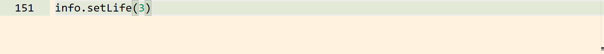

## Update Interval

- A loop that runs code repeatedly after a set time.

Example:

```javascript
game.onUpdateInterval(1000, function () {})

```

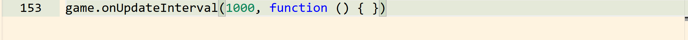
