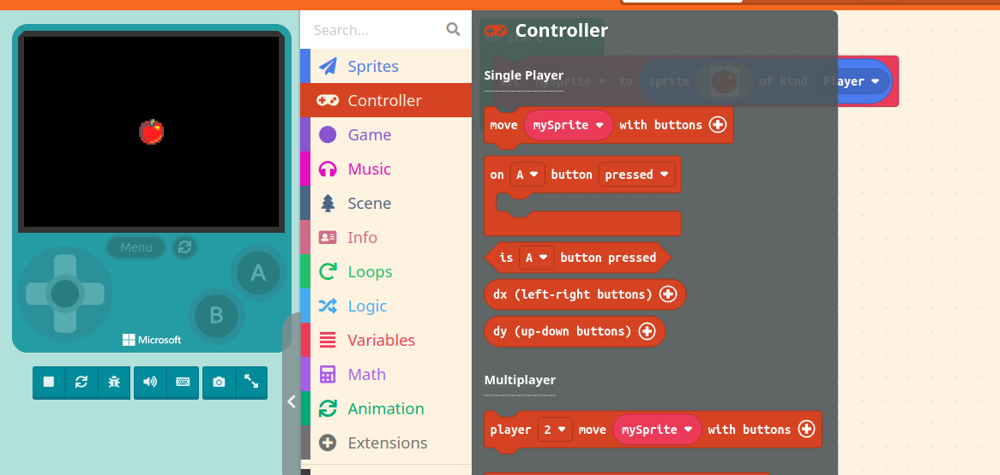

# Player Sprites

## Overview

The first step to creating a game is to have a player character. In this section, we will go over a few topics. By the end of this section, you will be able to create a player sprite.

For the purposes of this documentation, we'll be going over the tutorial in raw Javascript code. To get to the code view of your project, **click** on the button that says 'Javascript' at the top of the screen. You should now see a mostly blank screen, with a '1.'

## Creating a player sprite

Sprites are what MakeCode Arcade uses to refer to entities, or characters in the engine. We'll start with creating a sprite of the player type.

1. First, **click** on the 'Sprites' section of the code block menu. The tutorial should have showed you where this is, when you made an account.
2. Once you've clicked on 'Sprites', you'll see a few subsections. The 'Create' one should be at the top, alongside the code block that says 'sprite img of kind kind.'
3. **Click** and **drag** that out of the menu, and you'll have the block. **Drag** the block into the blank area. You can **let go** of the block, and you'll know it was added correctly if the code below appears.

```javascript
    let mySprite = sprites.create(img`
    . . . . . . . . . . . . . . . . 
    . . . . . . . . . . . . . . . . 
    . . . . . . . . . . . . . . . . 
    . . . . . . . . . . . . . . . . 
    . . . . . . . . . . . . . . . . 
    . . . . . . . . . . . . . . . . 
    . . . . . . . . . . . . . . . . 
    . . . . . . . . . . . . . . . . 
    . . . . . . . . . . . . . . . . 
    . . . . . . . . . . . . . . . . 
    . . . . . . . . . . . . . . . . 
    . . . . . . . . . . . . . . . . 
    . . . . . . . . . . . . . . . . 
    . . . . . . . . . . . . . . . . 
    . . . . . . . . . . . . . . . . 
    . . . . . . . . . . . . . . . . 
    `, SpriteKind.Player)
```

!!! info
    If you put in code incorrectly, you can delete it by **highlighting** with your mouse and hitting backspace.

    Or, you can hit ctrl+z to undo your last move, as well as shift+ctrl+z to redo your last move.


4. Right now, your player sprite is blank. To fix that, you can edit the dots to be other characters, which will reflect in the sprite. For the purpose of this documentation, **copy** and **paste** the code below in place of your empty sprite code, so that this new sprite is the only thing in your editor. This should turn your sprite into an apple. Optionally, you can create your own sprite by clicking the small floating palette that appears next to the code.
   
```javascript
    let mySprite = sprites.create(img`
    . . . . . . . e c 7 . . . . . . 
    . . . . e e e c 7 7 e e . . . . 
    . . c e e e e c 7 e 2 2 e e . . 
    . c e e e e e c 6 e e 2 2 2 e . 
    . c e e e 2 e c c 2 4 5 4 2 e . 
    c e e e 2 2 2 2 2 2 4 5 5 2 2 e 
    c e e 2 2 2 2 2 2 2 2 4 4 2 2 e 
    c e e 2 2 2 2 2 2 2 2 2 2 2 2 e 
    c e e 2 2 2 2 2 2 2 2 2 2 2 2 e 
    c e e 2 2 2 2 2 2 2 2 2 2 2 2 e 
    c e e 2 2 2 2 2 2 2 2 2 2 4 2 e 
    . e e e 2 2 2 2 2 2 2 2 2 4 e . 
    . 2 e e 2 2 2 2 2 2 2 2 4 2 e . 
    . . 2 e e 2 2 2 2 2 4 4 2 e . . 
    . . . 2 2 e e 4 4 4 2 e e . . . 
    . . . . . 2 2 e e e e . . . . . 
    `, SpriteKind.Player)
```

!!! info
    The reason this code uses numbers and letters to show what the sprite looks like is because we can't put an image directly into our code. 
    So the editor uses specific numbers and letters to signify each colour, so every letter and number is really a coloured pixel in your sprite!


5. You'll now see an apple in the game window on the left of the screen. It doesn't move right now, but don't worry! It's not broken. Movement will be covered in a future section.

## Setting up a camera

Now that we have our player sprite, you'll want to set up controls. Before that, though, you'll want a camera that follows your sprite around. If we don't have a camera, the sprite will be able to move off screen entirely.

1. Navigate to the 'scene' section of the code blocks, then find the 'camera' subsection. **Select** the block that says 'camera follow sprite mysprite.'

2. Similar to the last section, **click** and **drag** this block out of the menu into your code field. The code that appears should look like this.

```javascript
    scene.cameraFollowSprite(mySprite)
```

## Conclusion

After completing this section, you'll have the following:

* A player sprite with unique sprite art.
* A camera that will follow your player sprite around.

You can now move on to the next section, Enemy Sprites and Interaction. Nice work!
 [Enemy Page](docs/enemy.md)
