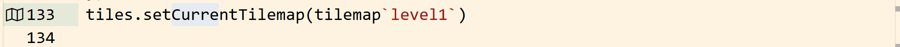
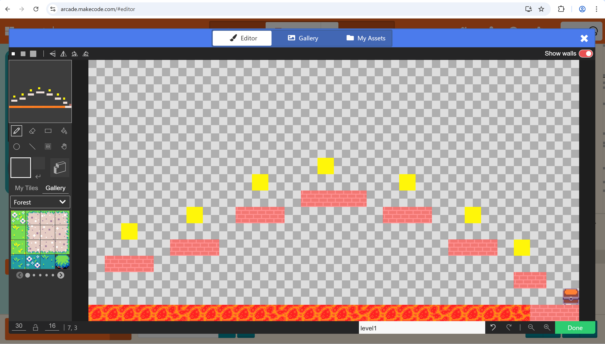
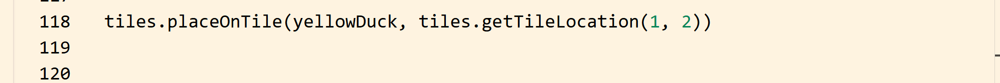
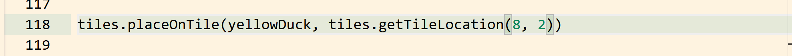
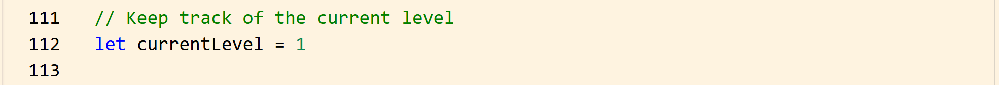
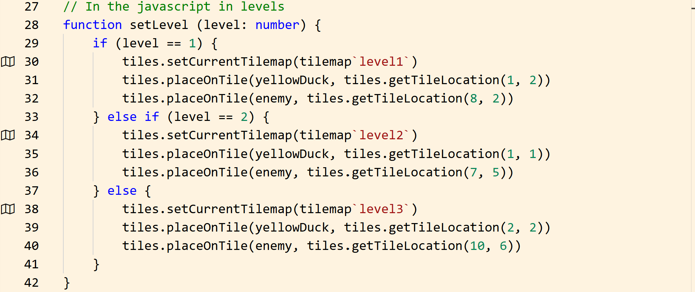
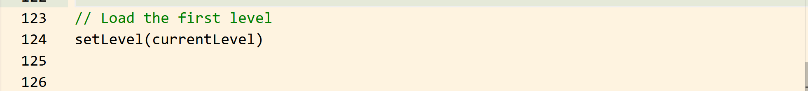
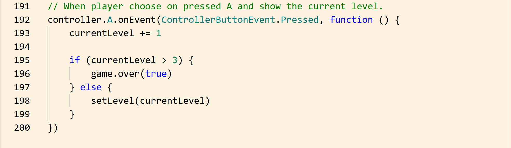

# Creating Tilemaps and Levels in MakeCode Arcade

In this tutorial, you will learn how to create*tilemaps and manage multiple levels in MakeCode Arcade.

Tilemaps define the layout of your game, including where the player and enemy appear. Levels allow your game to become more interactive and progressively challenging.

---

## Overview

A tilemap is a grid-based layout that represents your game world.  
Each tile can represent ground, walls, or special areas.

Tilemaps are important because they:

- Define the structure of the level  
- Control where sprites can move  
- Determine where objects are placed  

---

## Step 1: Create a Tilemap

- In MakeCode Arcade, tilemaps are usually created using the built-in editor.  

**Add** this code to load a tilemap.

```javascript
tiles.setCurrentTilemap(tilemap`level1`)
```



- This sets the current level layout to level1.



## Step 2: Place the Player on the Tilemap

- **Use** this code to place the player at a specific location after loading the tilemap.
  
```javascript
tiles.placeOnTile(player, tiles.getTileLocation(1, 2))
```



- This places the player at position (1, 2) on the grid.

## Step 3: Place the Enemy on the Tilemap

- **Use** this code to then place the enemy at a different position.
  
```javascript
tiles.placeOnTile(enemy, tiles.getTileLocation(8, 2))
```



- This ensures the enemy appears in the correct location when the level starts.

## Step 4: Create a Level Variable

- **Create** a variable to track the current level.
  
```javascript
let currentLevel = 1
```



- This variable will change as the player progresses.

## Step 5: Create the setLevel Function

```javascript
The setLevel() function loads different tilemaps and positions the sprites.

function setLevel(level: number) {
    if (level == 1) {
        tiles.setCurrentTilemap(tilemap`level1`)
        tiles.placeOnTile(player, tiles.getTileLocation(1, 2))
        tiles.placeOnTile(enemy, tiles.getTileLocation(8, 2))

    } else if (level == 2) {
        tiles.setCurrentTilemap(tilemap`level2`)
        tiles.placeOnTile(player, tiles.getTileLocation(1, 1))
        tiles.placeOnTile(enemy, tiles.getTileLocation(7, 5))

    } else {
        tiles.setCurrentTilemap(tilemap`level3`)
        tiles.placeOnTile(player, tiles.getTileLocation(2, 2))
        tiles.placeOnTile(enemy, tiles.getTileLocation(10, 6))
    }
}
```



This function:

- loads a different tilemap

- moves the player to a starting position

- places the enemy in a new location

## Step 6: Load the First Level

- **Call** the function to load the first level when the game starts.

```javascript
setLevel(currentLevel)
```



## Step 7: Change Levels During the Game

- **Use** a function to change levels when the player presses a button.
  
```javascript
controller.A.onEvent(ControllerButtonEvent.Pressed, function () {
    currentLevel += 1

    if (currentLevel > 3) {
        game.over(true)
    } else {
        setLevel(currentLevel)
    }
})
```



!!! info
    This allows the player to move through levels.

## Step 8: Improve Level Design

To make your levels better:

- PLace walls to block movement

- Create paths for the player

- Position enemies strategically

- Increase difficulty in each level

!!! warning
    Make sure you always test your code as you add it. If you add lots of code at once and run into an error, it becomes harder to find where things break.

## Conclusion

In this tutorial, you learned how to:

- Create and load tilemaps

- Place sprites on specific tiles

- Manage multiple levels

- Use a function to switch levels

- Control level progression

Tilemaps and levels are essential for building structured and engaging games. You can now check the next section, [Troubleshooting](troubleshooting.md), or check out the [Glossary](glossary.md).
